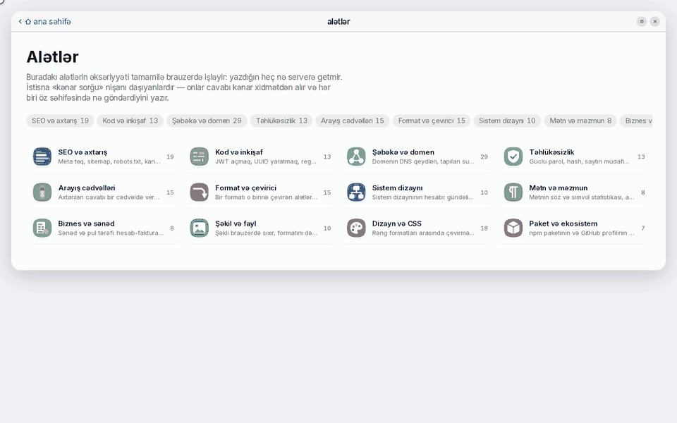
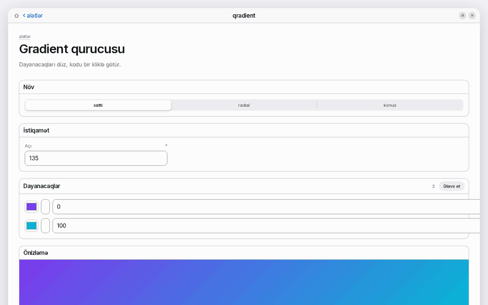
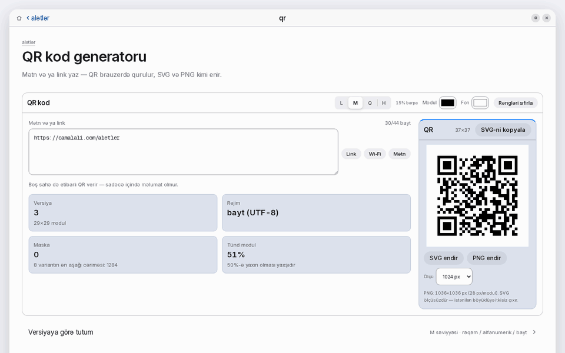
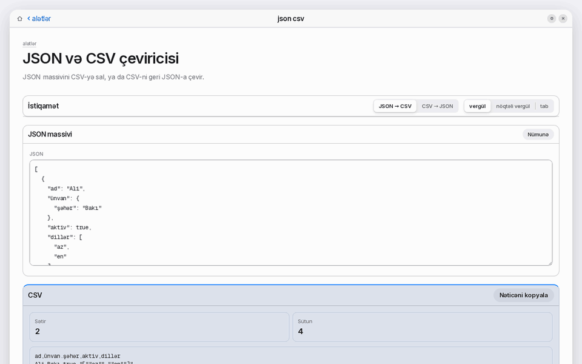
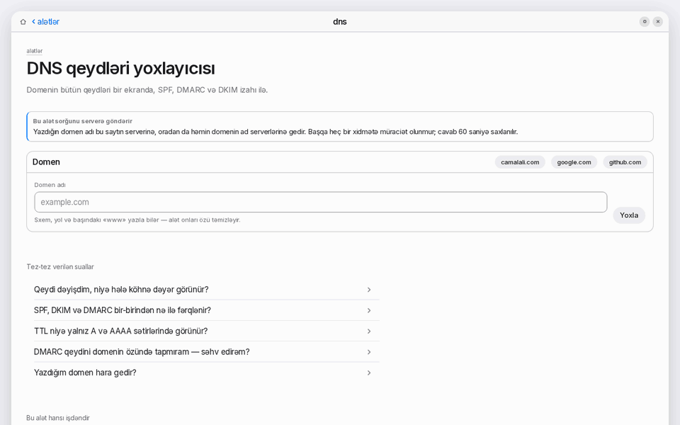

# camalali-tools

     



**166 small developer tools in one repository.** A JWT decoder, a cron parser, a regex tester, Base64 and hash tools, a UUID generator, a JSON formatter, DNS lookup, an SSL certificate checker, an HTTP headers reference, a CIDR calculator, a colour converter and a QR code generator are all in here, alongside the rest of the 166 across 12 categories.

Nothing is uploaded and nothing is tracked. 131 of the 166 tools compute entirely in the browser; the other 35 ask a named outside service (DNS, TLS, a package registry) from a server route you can read before you run it. The logic in `lib/` is plain TypeScript, and 160 of the 166 tools import nothing at all.

These are generated from the source of [camalali.com/alet](https://camalali.com/alet), where every one of them runs as a live page. The site's window manager is not included; the tools are.

The tool names and the site are in Azerbaijani, because that is who they were written for. The English index below says what each one does. **Azərbaycanca oxumaq üçün: [aşağıdakı bölmə](#azerbaycanca).**

## Quick start

Copy `lib/cron.ts` into your project, import it, call it. No third-party dependency:

```ts
import { parseCron, describeCron } from "./lib/cron";

const cron = parseCron("*/15 9-17 * * 1-5");
if (cron.ok) console.log(describeCron(cron.cron));
```

## Examples

<table>
<tr>
  <td width="50%">
    <br />
    <b>Gradient qurucusu</b><br />
    CSS gradient generator: linear, radial and conic, with any number of colour stops.<br />
    <a href="https://camalali.com/alet/qradient">open the tool →</a>
  </td>
  <td width="50%">
    <br />
    <b>QR kod generatoru</b><br />
    QR code generator for text and links, as SVG and PNG.<br />
    <a href="https://camalali.com/alet/qr">open the tool →</a>
  </td>
</tr>
<tr>
  <td width="50%">
    <br />
    <b>JSON və CSV çeviricisi</b><br />
    JSON to CSV converter, and a CSV table back to JSON.<br />
    <a href="https://camalali.com/alet/json-csv">open the tool →</a>
  </td>
  <td width="50%">
    <br />
    <b>DNS qeydləri yoxlayıcısı</b><br />
    DNS lookup: a domain's main DNS records and mail policies on one screen.<br />
    <a href="https://camalali.com/alet/dns">open the tool →</a>
  </td>
</tr>
</table>

## Categories

<table>
<tr>
  <td width="33%" valign="top">
    <br />
    <b>SEO and search</b><br />
    <sub>Meta tags, sitemap, robots.txt and canonical URLs. Checks keywords, links and how a page looks in search.</sub><br />
    20 tools · <a href="kateqoriya/seo.md">list</a>
  </td>
  <td width="33%" valign="top">
    <br />
    <b>Code and development</b><br />
    <sub>Decodes JWTs, generates UUIDs, tests regular expressions and reads cron expressions. Diffs text and formats SQL.</sub><br />
    13 tools · <a href="kateqoriya/kod.md">list</a>
  </td>
  <td width="33%" valign="top">
    <br />
    <b>Network and domains</b><br />
    <sub>Shows a domain's DNS records and the subdomains found for it. Calculates IP subnets.</sub><br />
    29 tools · <a href="kateqoriya/shebeke.md">list</a>
  </td>
</tr>
<tr>
  <td width="33%" valign="top">
    <br />
    <b>Security</b><br />
    <sub>Generates passwords and hashes. Checks a site's security headers and whether a password appears in known breaches.</sub><br />
    13 tools · <a href="kateqoriya/tehlukesizlik.md">list</a>
  </td>
  <td width="33%" valign="top">
    <br />
    <b>Reference tables</b><br />
    <sub>Reference for status codes, HTTP headers, MIME types and ports. Commands, permissions and characters too.</sub><br />
    15 tools · <a href="kateqoriya/cedvel.md">list</a>
  </td>
  <td width="33%" valign="top">
    <br />
    <b>Formats and converters</b><br />
    <sub>Converts between JSON, YAML, Base64, URL encoding and naming cases.</sub><br />
    15 tools · <a href="kateqoriya/format.md">list</a>
  </td>
</tr>
<tr>
  <td width="33%" valign="top">
    <br />
    <b>System design</b><br />
    <sub>Calculates RPS, storage and server count from a daily request figure. Points at a database and architecture choice.</sub><br />
    10 tools · <a href="kateqoriya/sistem.md">list</a>
  </td>
  <td width="33%" valign="top">
    <br />
    <b>Text and content</b><br />
    <sub>Counts words and characters. Generates Azerbaijani placeholder text and slugs from a title.</sub><br />
    8 tools · <a href="kateqoriya/metn.md">list</a>
  </td>
  <td width="33%" valign="top">
    <br />
    <b>Business and documents</b><br />
    <sub>Builds an invoice, estimates how long a project takes and shows currency rates.</sub><br />
    8 tools · <a href="kateqoriya/biznes.md">list</a>
  </td>
</tr>
<tr>
  <td width="33%" valign="top">
    <br />
    <b>Images and files</b><br />
    <sub>Compresses and converts an image in the browser. Makes a QR code from a given address.</sub><br />
    10 tools · <a href="kateqoriya/fayl.md">list</a>
  </td>
  <td width="33%" valign="top">
    <br />
    <b>Design and CSS</b><br />
    <sub>Converts between colour formats and measures the contrast of text against its background.</sub><br />
    18 tools · <a href="kateqoriya/dizayn.md">list</a>
  </td>
  <td width="33%" valign="top">
    <br />
    <b>Packages and ecosystem</b><br />
    <sub>Shows an npm package's version, size and dependencies. Also fetches a GitHub profile's activity.</sub><br />
    7 tools · <a href="kateqoriya/ekosistem.md">list</a>
  </td>
</tr>
</table>

The per-category pages under `kateqoriya/` are in Azerbaijani. The English index below covers the same 166 tools.

## All 166 tools

<details>
<summary><b>SEO and search</b> (20 tools)</summary>

| Tool | What it does | Logic file |
|---|---|---|
| [Meta teq generatoru və önizləmə](https://camalali.com/alet/meta) | Meta tag generator with Google and social card previews. | `lib/meta.ts` |
| [robots.txt qurucusu və yoxlayıcısı](https://camalali.com/alet/robots) | robots.txt builder and tester: build from a template, then test a URL against a chosen bot. | `lib/robots.ts` |
| [Yönləndirmə qaydası generatoru](https://camalali.com/alet/yonlendirme) | Redirect rule generator: old and new URL pairs turned into rules in four server formats. | `lib/yonlendirme.ts` |
| [SERP önizləməsi](https://camalali.com/alet/serp-onizleme) | SERP preview: where a title gets cut off in mobile and desktop Google results. | `lib/serp-onizleme.ts` |
| [Schema.org JSON-LD qurucusu](https://camalali.com/alet/schema) | Schema.org JSON-LD builder for six types, with missing fields and JSON errors pointed out. | `lib/schema.ts` |
| [Açar söz sıxlığı](https://camalali.com/alet/acar-soz-sixligi) | Keyword density: counts of one, two and three word phrases and their share of the text. | `lib/acar-soz-sixligi.ts` |
| [Açar söz qruplaşdırması](https://camalali.com/alet/acar-soz-qruplasdirma) | Keyword clustering: keywords grouped into topics by their shared stems. | `lib/acar-soz-qruplasdirma.ts` |
| [Başlıq strukturu yoxlayıcısı](https://camalali.com/alet/basliq-strukturu) | Heading structure checker: the tree of HTML headings and its hierarchy faults. | `lib/basliq-strukturu.ts` |
| [Link analizi](https://camalali.com/alet/link-analizi) | Link analysis: internal and external links, anchor text and risky link attributes in one table. | `lib/link-analizi.ts` |
| [Kanonik URL normallaşdırıcısı](https://camalali.com/alet/kanonik) | Canonical URL normaliser: collapses the URL variants of one page under rules you choose. | `lib/kanonik.ts` |
| [hreflang qurucusu](https://camalali.com/alet/hreflang) | hreflang builder in three formats, and a validator for code, return-link and address errors. | `lib/hreflang.ts` |
| [UTM link qurucusu](https://camalali.com/alet/utm) | UTM link builder, and a parser that splits a tagged link back into its parameters. | `lib/utm.ts` |
| [Toplu meta yoxlaması](https://camalali.com/alet/toplu-meta) | Bulk meta audit: title and description faults across a CSV or TSV, downloadable as CSV. | `lib/toplu-meta.ts` |
| [sitemap.xml qurucusu](https://camalali.com/alet/sitemap-qurucu) | sitemap.xml builder that splits into parts and an index file past the 50,000 URL or 50 MB limit. | `lib/sitemap-qurucu.ts` |
| [llms.txt qurucusu](https://camalali.com/alet/llms-txt) | llms.txt builder, with structural errors reported by line number. | `lib/llms-txt.ts` |
| [Open Graph önizləməsi](https://camalali.com/alet/og-onizleme) | Open Graph preview: how a link's card looks on four social platforms. | `lib/og-onizleme.ts` |
| [Sitemap və lent yoxlayıcısı](https://camalali.com/alet/sitemap-yoxlayici) | Sitemap and feed validator for a live sitemap, RSS or Atom file: addresses, date range, duplicates and XML faults. | `lib/sitemap-yoxlayici.ts` |
| [Yönləndirmə zənciri](https://camalali.com/alet/yonlendirme-zenciri) | Redirect chain tracer: every hop, its status code and the final destination. | `lib/yonlendirme-zenciri.ts` |
| [Canlı robots.txt yoxlayıcısı](https://camalali.com/alet/robots-canli) | Live robots.txt tester: which rule blocks a path, and the line number it sits on. | `lib/robots-canli.ts` |
| [Birləşik sayt hesabatı](https://camalali.com/alet/sayt-hesabati) | Combined site report: security, speed, meta and indexing for one address in one report. |  |

</details>

<details>
<summary><b>Code and development</b> (13 tools)</summary>

| Tool | What it does | Logic file |
|---|---|---|
| [JWT dekoderi](https://camalali.com/alet/jwt) | JWT decoder: header, payload and whether the token has expired. | `lib/jwt.ts` |
| [UUID generatoru](https://camalali.com/alet/uuid) | UUID generator, v4 and v7, for when identifiers have to sort. | `lib/uuid.ts` |
| [Regex test aləti](https://camalali.com/alet/regex) | Regex tester: matches and capture groups shown as you type. | `lib/regex.ts` |
| [Cron ifadəsi izahçısı](https://camalali.com/alet/cron) | Cron expression parser: the five fields explained in words, with the next run times. | `lib/cron.ts` |
| [Mətn fərqi (diff)](https://camalali.com/alet/ferq) | Text diff: the line-level differences between two texts in one view. | `lib/ferq.ts` |
| [Markdown önizləməsi](https://camalali.com/alet/markdown) | Markdown preview that renders live and hands back the HTML source. | `lib/markdown.ts` |
| [SQL formatlayıcı](https://camalali.com/alet/sql) | SQL formatter with indented and minified output. | `lib/sql.ts` |
| [Unix vaxt çeviricisi](https://camalali.com/alet/vaxt) | Unix timestamp converter: epoch seconds or milliseconds to a date, and a date back to a timestamp. | `lib/vaxt.ts` |
| [JSON struktur fərqi](https://camalali.com/alet/json-ferq) | JSON structural diff by key path, as a tree and as an RFC 6902 JSON Patch. | `lib/json-ferq.ts` |
| [JSON-dan tip qurucusu](https://camalali.com/alet/json-tip) | JSON to type generator: TypeScript, Zod, Go, TypedDict and dataclass. | `lib/json-tip.ts` |
| [curl əmrindən kod çevirici](https://camalali.com/alet/curl-kod) | curl to code converter for seven languages, and `fetch` code back into a curl command. | `lib/curl-kod.ts` |
| [Regex izahçısı](https://camalali.com/alet/regex-izahci) | Regex explainer: a parse tree of the pattern, with warnings for the known traps. | `lib/regex-izahci.ts` |
| [Azərbaycan formatında test verilənləri](https://camalali.com/alet/test-verilenleri) | Test data generator in Azerbaijani formats, as JSON, CSV or SQL `INSERT` statements. | `lib/test-verilenleri.ts` |

</details>

<details>
<summary><b>Network and domains</b> (29 tools)</summary>

| Tool | What it does | Logic file |
|---|---|---|
| [DNS qeydləri yoxlayıcısı](https://camalali.com/alet/dns) | DNS lookup: a domain's main DNS records and mail policies on one screen. | `lib/dns.ts` |
| [Domenin subdomenləri](https://camalali.com/alet/subdomen) | Subdomain finder from the public certificate transparency logs, with first-seen dates. | `lib/subdomen.ts` |
| [Subnet və IP kalkulyatoru](https://camalali.com/alet/subnet) | Subnet and CIDR calculator: network, broadcast, masks and host range for IPv4; short and full form for IPv6. | `lib/subnet.ts` |
| [IPv6 ünvan aləti](https://camalali.com/alet/ipv6) | IPv6 address tool: expands and compresses an address, and gives the prefix range and reverse DNS name. | `lib/ipv6.ts` |
| [VLSM subnet planlayıcısı](https://camalali.com/alet/subnet-planlayici) | VLSM subnet planner: fits host requirements into blocks and shows the addresses wasted. | `lib/subnet-planlayici.ts` |
| [CIDR birləşdirmə və IP aralığı çevirici](https://camalali.com/alet/cidr-birlesdirme) | CIDR calculator: turns an IP range into the smallest set of CIDR blocks and removes duplicates and overlaps. | `lib/cidr-birlesdirme.ts` |
| [Wildcard maska çeviricisi](https://camalali.com/alet/wildcard-maska) | Wildcard mask converter between prefix, subnet and wildcard, with Cisco ACL, OSPF and iptables syntax. | `lib/wildcard-maska.ts` |
| [Bant genişliyi və ötürmə vaxtı kalkulyatoru](https://camalali.com/alet/bant-genisliyi) | Bandwidth and transfer time calculator, including the real throughput left after protocol overhead. | `lib/bant-genisliyi.ts` |
| [Mənim IP ünvanım](https://camalali.com/alet/menim-ip) | What is my IP: your public IP with ASN and RDAP data, next to what the browser reports. | `lib/menim-ip.ts` |
| [Domen qeydiyyat sorğusu (whois)](https://camalali.com/alet/whois) | Whois and RDAP domain lookup: a domain's age, expiry, registrar and EPP status. | `lib/whois.ts` |
| [Domenin poçt qeydləri](https://camalali.com/alet/mail-qeydleri) | Mail records for a domain, from MX to BIMI, with DKIM results for the known selectors. | `lib/mail-qeydleri.ts` |
| [SPF DNS sorğu limiti yoxlayıcısı](https://camalali.com/alet/spf-yoxlayici) | SPF DNS lookup limit checker: expands include and redirect branches and shows what spends the RFC limit of 10. | `lib/spf-yoxlayici.ts` |
| [DMARC qeydini izah edən və quran alət](https://camalali.com/alet/dmarc-oxucu) | DMARC record explainer and builder: reads the tags, then writes a new DNS record from fields. | `lib/dmarc-oxucu.ts` |
| [DNS propaqasiya yoxlayıcısı](https://camalali.com/alet/dns-propaqasiya) | DNS propagation checker across six public resolvers and the domain's own authoritative servers. | `lib/dns-propaqasiya.ts` |
| [SSL sertifikat müfəttişi](https://camalali.com/alet/ssl) | SSL certificate checker: days remaining, SAN names, key size and chain gaps. | `lib/ssl.ts` |
| [TLS versiyaları yoxlayıcısı](https://camalali.com/alet/tls-versiyalari) | TLS version checker: tests TLS 1.0 to 1.3 one by one and records the cipher each accepts. | `lib/tls-versiyalari.ts` |
| [DNSSEC yoxlaması](https://camalali.com/alet/dnssec) | DNSSEC check that compares the parent zone against the domain's own nameservers. | `lib/dnssec.ts` |
| [Tərs DNS (PTR) yoxlayıcısı](https://camalali.com/alet/ptr) | Reverse DNS (PTR) lookup for an IPv4 or IPv6 address, with a forward-confirmed check. | `lib/ptr.ts` |
| [Zona faylı qurucusu](https://camalali.com/alet/zone-fayl) | Zone file builder: a BIND zone file into a checked table, and the table back into a zone file. | `lib/zone-fayl.ts` |
| [Cavab vaxtının mərhələ-mərhələ parçalanması](https://camalali.com/alet/cavab-vaxti) | Response time breakdown by DNS, TCP, TLS and TTFB, from the median of three connections. | `lib/cavab-vaxti.ts` |
| [HSTS başlığı yoxlayıcısı](https://camalali.com/alet/hsts) | HSTS header checker: max-age and subdomain policy, and what is still missing for Chrome preload. | `lib/hsts.ts` |
| [Security.txt oxuyucusu](https://camalali.com/alet/security-txt) | security.txt reader: RFC 9116 fields, expiry date and PGP signature, at both standard paths. | `lib/security-txt.ts` |
| [Keşləmə başlıqları müfəttişi](https://camalali.com/alet/kesh-basliqlari) | Cache header inspector: how long a response stays fresh, and which directives contradict. | `lib/kesh-basliqlari.ts` |
| [Sıxılma yoxlayıcısı](https://camalali.com/alet/sixilma) | Compression checker: size comparison for gzip, Brotli and Zstandard. | `lib/sixilma.ts` |
| [CORS yoxlayıcısı](https://camalali.com/alet/cors-yoxlama) | CORS checker: simple GET and OPTIONS preflight responses, allowed methods and missing headers. | `lib/cors-yoxlama.ts` |
| [Qarışıq məzmun tapıcısı](https://camalali.com/alet/qarisiq-mezmun) | Mixed content finder: the HTTP resources left on an HTTPS page and how a browser treats them. | `lib/qarisiq-mezmun.ts` |
| [E-poçt başlığı analizatoru](https://camalali.com/alet/mail-basliq-analizi) | Email header analyser: raw headers turned into a delivery chain, with the delays and the spoofing signs. | `lib/mail-basliq-analizi.ts` |
| [Hosting və texnologiya təsbiti](https://camalali.com/alet/hosting-tespiti) | Hosting and technology detection: CDN, cloud provider and CMS traces from headers, HTML, DNS and RDAP. | `lib/hosting-tespiti.ts` |
| [IP ünvan müfəttişi](https://camalali.com/alet/ip) | IP address lookup: address type, network block, organisation, ASN and reverse DNS. | `lib/ip.ts` |

</details>

<details>
<summary><b>Security</b> (13 tools)</summary>

| Tool | What it does | Logic file |
|---|---|---|
| [HTTP təhlükəsizlik başlıqları](https://camalali.com/alet/basliqlar) | HTTP security headers checker, graded from A to F. | `lib/basliqlar.ts` |
| [Hash generatoru](https://camalali.com/alet/hash) | Hash generator: the MD5, SHA-1 and SHA-256 of a text at once. | `lib/hash.ts` |
| [Parol sızıb-sızmadığını yoxla](https://camalali.com/alet/parol-sizmasi) | Password breach check: only the first five characters of the SHA-1 hash leave the browser (k-anonymity). | `lib/parol-sizmasi.ts` |
| [Təsadüfi parol generatoru](https://camalali.com/alet/parol) | Random password generator built in the browser from a chosen length and character sets. | `lib/parol.ts` |
| [SSH açıq açar yoxlayıcısı](https://camalali.com/alet/ssh-parmaq-izi) | SSH public key checker: SHA256 and MD5 fingerprints, real key strength and `authorized_keys` options. | `lib/ssh-parmaq-izi.ts` |
| [HMAC hesablayıcı](https://camalali.com/alet/hmac) | HMAC calculator in hex and Base64, compared against an expected value. | `lib/hmac.ts` |
| [TOTP kod generatoru](https://camalali.com/alet/totp) | TOTP code generator: the previous, current and next code from a Base32 secret, with a countdown. | `lib/totp.ts` |
| [JWT imzalama və yoxlama](https://camalali.com/alet/jwt-imza) | JWT signer and verifier for HS256, HS384 and HS512, with the time claims checked in the same place. | `lib/jwt-imza.ts` |
| [AES-GCM şifrələmə](https://camalali.com/alet/sifreleme) | AES-GCM encryption: seals and opens an AES-256-GCM package with a password-derived key. | `lib/sifreleme.ts` |
| [bcrypt hash və yoxlama](https://camalali.com/alet/bcrypt) | bcrypt hash and verify, with the measured time for a chosen cost and a warning past 72 bytes. | `lib/bcrypt.ts` |
| [RSA açar cütü, şifrələmə və imza](https://camalali.com/alet/rsa) | RSA key pair generator: encrypts, decrypts, signs and verifies. | `lib/rsa.ts` |
| [HTTP Basic Auth qurucusu](https://camalali.com/alet/basic-auth) | HTTP Basic Auth builder with the header and ready server and curl lines. | `lib/basic-auth.ts` |
| [Content-Security-Policy qurucusu və izahçısı](https://camalali.com/alet/csp-qurucu) | Content-Security-Policy builder and explainer, including where a policy is weak. | `lib/csp-qurucu.ts` |

</details>

<details>
<summary><b>Reference tables</b> (15 tools)</summary>

| Tool | What it does | Logic file |
|---|---|---|
| [HTTP status kodları](https://camalali.com/alet/status-kodlari) | HTTP status codes from 1xx to 5xx, what they mean and when they are returned. | `lib/status-kodlari.ts` |
| [HTTP başlıqları lüğəti](https://camalali.com/alet/http-basliqlari) | HTTP headers reference: what each header does, with real example values. | `lib/http-basliqlari.ts` |
| [MIME tipləri](https://camalali.com/alet/mime) | MIME types: extension to MIME type, and MIME type back to extension. | `lib/mime.ts` |
| [Şəbəkə portları](https://camalali.com/alet/portlar) | Network ports: which service owns a port and the risk of exposing it to the internet. | `lib/portlar.ts` |
| [git əmrləri](https://camalali.com/alet/git-emrleri) | Git command reference, from daily work to remotes, with ready examples. | `lib/git-emrleri.ts` |
| [docker əmrləri](https://camalali.com/alet/docker-emrleri) | Docker command reference: containers, images, Compose, networks, volumes and debugging. | `lib/docker-emrleri.ts` |
| [chmod icazə hesablayıcısı](https://camalali.com/alet/chmod) | chmod permission calculator: octal mode, rwx and a permission grid, with the command ready to copy. | `lib/chmod.ts` |
| [Ölçü vahidləri çeviricisi](https://camalali.com/alet/olcu-vahidleri) | Unit converter for data size, transfer rate and duration, in decimal and binary, with download and downtime figures. | `lib/olcu-vahidleri.ts` |
| [Linux əmrləri arayışı](https://camalali.com/alet/linux-emrleri) | Linux command reference grouped by what you are doing, with working examples. | `lib/linux-emrleri.ts` |
| [Regex sintaksis cədvəli](https://camalali.com/alet/regex-spar) | Regex syntax cheat sheet from character classes to lookaround, each with a matching example. | `lib/regex-spar.ts` |
| [Simvol müfəttişi və ASCII cədvəli](https://camalali.com/alet/ascii-unicode) | Character inspector and ASCII table: code point, UTF-8 bytes, UTF-16 units and invisible characters. | `lib/ascii-unicode.ts` |
| [DNS qeyd tipləri](https://camalali.com/alet/dns-qeyd-tipleri) | 50 DNS record and query types, with the code, an example and the pitfall for each. | `lib/dns-qeyd-tipleri.ts` |
| [Subnet cədvəli](https://camalali.com/alet/subnet-cedveli) | Subnet table: IPv4 CIDR prefixes with masks and wildcards, everyday IPv6 prefixes and reserved ranges. | `lib/subnet-cedveli.ts` |
| [Wi-Fi standartları](https://camalali.com/alet/wifi-standartlari) | Wi-Fi standards compared by theoretical and real throughput, with channel, security and router terms explained. | `lib/wifi-standartlari.ts` |
| [Kabel kateqoriyaları](https://camalali.com/alet/kabel-kateqoriyalari) | Cable categories: speed, distance, shielding code, PoE power and pinout. | `lib/kabel-kateqoriyalari.ts` |

</details>

<details>
<summary><b>Formats and converters</b> (15 tools)</summary>

| Tool | What it does | Logic file |
|---|---|---|
| [JSON formatlayıcı və yoxlayıcı](https://camalali.com/alet/json) | JSON formatter and validator: pretty-print or minify, with errors located by line and column. | `lib/json.ts` |
| [Base64 kodlayıcı və dekoder](https://camalali.com/alet/base64) | Base64 encoder and decoder, including the URL-safe alphabet. | `lib/base64.ts` |
| [Ad formatı çeviricisi](https://camalali.com/alet/ad-formati) | Naming case converter: nine identifier styles, camelCase and snake_case among them, on one screen. | `lib/ad-formati.ts` |
| [URL kodlaşdırıcı və parçalayıcı](https://camalali.com/alet/url) | URL encoder, decoder, parser and query-string editor. | `lib/url.ts` |
| [YAML və JSON çeviricisi](https://camalali.com/alet/yaml) | YAML to JSON converter both ways, with line-numbered errors and a Markdown frontmatter mode. | `lib/yaml.ts` |
| [JSON və CSV çeviricisi](https://camalali.com/alet/json-csv) | JSON to CSV converter, and a CSV table back to JSON. | `lib/json-csv.ts` |
| [JSON və XML çeviricisi](https://camalali.com/alet/json-xml) | JSON to XML converter that keeps keys, arrays and attributes intact. | `lib/json-xml.ts` |
| [JSON və TOML çeviricisi](https://camalali.com/alet/json-toml) | JSON to TOML converter, both directions. | `lib/json-toml.ts` |
| [XML formatlayıcı və yoxlayıcı](https://camalali.com/alet/xml) | XML formatter and validator: indent, minify and check structure with line numbers. | `lib/xml.ts` |
| [Cədvəl çeviricisi](https://camalali.com/alet/cedvel) | Table converter between Markdown, HTML, CSV and JSON. | `lib/cedvel.ts` |
| [CSV müfəttişi](https://camalali.com/alet/csv) | CSV inspector: finds the delimiter, the header, the column types and the malformed rows. | `lib/csv.ts` |
| [.env alətləri](https://camalali.com/alet/env) | `.env` toolkit: convert to and from JSON, write an example file, and diff two `.env` files for missing keys. | `lib/env.ts` |
| [Siyahı emalı aləti](https://camalali.com/alet/siyahi) | List processor: chained operations on a list, plus the intersection and difference of two lists. | `lib/siyahi.ts` |
| [Say sistemi çeviricisi](https://camalali.com/alet/say-sistemi) | Number base converter for bases 2 to 36, with bit toggling and bitwise operations. | `lib/say-sistemi.ts` |
| [Fayl ↔ Base64 çeviricisi](https://camalali.com/alet/base64-fayl) | File to Base64 converter with a ready data URI, and Base64 text back to a downloadable file. | `lib/base64-fayl.ts` |

</details>

<details>
<summary><b>System design</b> (10 tools)</summary>

| Tool | What it does | Logic file |
|---|---|---|
| [Yük və miqyas kalkulyatoru](https://camalali.com/alet/miqyas) | Load and scale calculator: RPS, storage and server count from a daily request figure. | `lib/miqyas.ts` |
| [Arxitektura seçim köməkçisi](https://camalali.com/alet/arxitektura) | Architecture decision helper: a few questions, then a recommendation with its reasoning. | `lib/arxitektura.ts` |
| [Gecikmə büdcəsi hesablayıcısı](https://camalali.com/alet/gecikme) | Latency budget calculator: per-stage timings summed into end-to-end latency, with the miss against a target. | `lib/gecikme.ts` |
| [Əlçatanlıq hesablayıcısı](https://camalali.com/alet/elcatanliq) | Uptime calculator: converts an SLA percentage into allowed downtime and back. | `lib/elcatanliq.ts` |
| [Keş büdcəsi hesablayıcısı](https://camalali.com/alet/kesh) | Cache budget calculator: the effect of cache size on hit ratio, latency and origin load, plus memory per key. | `lib/kesh.ts` |
| [Növbə və gözləmə hesablayıcısı](https://camalali.com/alet/novbe) | Queueing calculator: average wait, queue length and requests in system from arrival rate and capacity. | `lib/novbe.ts` |
| [Şard və replika planlayıcısı](https://camalali.com/alet/shard) | Shard and replica planner: future shard and disk need, and how many keys move when the shard count changes. | `lib/shard.ts` |
| [Sürət həddi (rate limit) hesablayıcısı](https://camalali.com/alet/rate-limit) | Rate limit calculator comparing token bucket, sliding window and fixed window side by side. | `lib/rate-limit.ts` |
| [Jurnal (log) büdcəsi hesablayıcısı](https://camalali.com/alet/log-budcesi) | Log budget calculator: the disk cost of a log stream and the risk of sampling it. | `lib/log-budcesi.ts` |
| [CAP teoremi seçim bələdçisi](https://camalali.com/alet/cap-secimi) | CAP theorem guide: how five answers push a system towards CP or AP during a partition. | `lib/cap-secimi.ts` |

</details>

<details>
<summary><b>Text and content</b> (8 tools)</summary>

| Tool | What it does | Logic file |
|---|---|---|
| [Mətn statistikası](https://camalali.com/alet/metn-statistikasi) | Word counter: words, characters, sentences and paragraphs of a text. | `lib/metn-statistikasi.ts` |
| [Azərbaycanca nümunə mətn](https://camalali.com/alet/numune-metn) | Lorem ipsum in Azerbaijani, for mockups. | `lib/numune-metn.ts` |
| [Slug generatoru](https://camalali.com/alet/slug) | Slug generator: transliterates an Azerbaijani title into a URL slug. | `lib/slug.ts` |
| [Mətn təmizləyicisi](https://camalali.com/alet/metn-temizleyici) | Text cleaner: locates invisible characters, smart quotes and stray whitespace, each rule switched on separately. | `lib/metn-temizleyici.ts` |
| [Unicode müfəttişi](https://camalali.com/alet/unicode) | Unicode inspector: code point, JS and URL escapes and UTF-8 bytes, character by character. | `lib/unicode.ts` |
| [Hərf registri çeviricisi](https://camalali.com/alet/herf-registri) | Letter case converter with the Azerbaijani I/ı and İ/i rules applied. | `lib/herf-registri.ts` |
| [Oxunaqlıq ölçüsü](https://camalali.com/alet/oxunaqliq) | Readability score: sentence and word length, repetition, passive voice share and reading time. | `lib/oxunaqliq.ts` |
| [Sətir qaçırma aləti](https://camalali.com/alet/escape) | String escape and unescape for JSON, HTML, XML, URL, SQL, shell, regex, CSV, Base64 and JS. | `lib/escape.ts` |

</details>

<details>
<summary><b>Business and documents</b> (8 tools)</summary>

| Tool | What it does | Logic file |
|---|---|---|
| [Layihə qiymətləndiricisi](https://camalali.com/alet/qiymetlendirici) | Project estimator: four questions turn into a phase plan and a duration range in working days. | `lib/estimate.ts` |
| [Hesab-faktura generatoru](https://camalali.com/alet/faktura) | Invoice generator: add line items, pick a VAT rate, download the PDF. |  |
| [Valyuta çevirici](https://camalali.com/alet/valyuta) | Currency converter with dated exchange rates for AZN and world currencies. | `lib/valyuta.ts` |
| [PDF birləşdirici](https://camalali.com/alet/pdf-birlesdir) | PDF merge: combine several PDFs, choosing the page range taken from each one. | `lib/pdf-birlesdir.ts` |
| [PDF bölücü](https://camalali.com/alet/pdf-bol) | PDF split: cut a PDF page by page, by written ranges, or every N pages. | `lib/pdf-bol.ts` |
| [PDF səhifə redaktoru](https://camalali.com/alet/pdf-sehife) | PDF page editor: reorder, rotate, delete and duplicate pages. | `lib/pdf-sehife.ts` |
| [Şəkildən PDF yaradıcısı](https://camalali.com/alet/sekil-pdf) | Image to PDF: order PNG and JPEG images and collect them into a single PDF. | `lib/sekil-pdf.ts` |
| [PDF su nişanı və səhifə nömrəsi](https://camalali.com/alet/pdf-nisan) | PDF watermark and page numbering for selected pages. | `lib/pdf-nisan.ts` |

</details>

<details>
<summary><b>Images and files</b> (10 tools)</summary>

| Tool | What it does | Logic file |
|---|---|---|
| [QR kod generatoru](https://camalali.com/alet/qr) | QR code generator for text and links, as SVG and PNG. | `lib/qr.ts` |
| [Şəkil sıxıcısı və çeviricisi](https://camalali.com/alet/sekil) | Image compressor and converter: resizes and converts JPEG, PNG and WebP in the browser, with no upload. | `lib/sekil.ts` |
| [Favicon dəsti generatoru](https://camalali.com/alet/favicon) | Favicon set generator with the web manifest and the `<head>` markup to paste. | `lib/favicon.ts` |
| [Paylaşım şəkli (Open Graph) generatoru](https://camalali.com/alet/og-sekil) | Open Graph image generator: a share PNG drawn on canvas, downloadable in three sizes. | `lib/og-sekil.ts` |
| [SVG optimallaşdırıcı](https://camalali.com/alet/svg-optimallasdirici) | SVG optimiser with individually selectable rules and the saving in bytes and percent. | `lib/svg-optimallasdirici.ts` |
| [SVG-dən PNG çevirici](https://camalali.com/alet/svg-png) | SVG to PNG converter at any pixel size or at 1x, 2x and 3x. | `lib/svg-png.ts` |
| [EXIF oxucusu və təmizləyicisi](https://camalali.com/alet/exif) | EXIF reader and remover for camera, date and GPS metadata. | `lib/exif.ts` |
| [Şəkildən rəng palitrası çıxarıcısı](https://camalali.com/alet/sekil-reng) | Image colour palette extractor: 2 to 16 dominant colours with their share, copyable as CSS variables. | `lib/sekil-reng.ts` |
| [QR kod oxuyucu](https://camalali.com/alet/qr-oxuyucu) | QR code reader that decodes an image in the browser, with nothing sent to a server. | `lib/qr-oxuyucu.ts` |
| [Kod şəkli generatoru](https://camalali.com/alet/kod-sekil) | Code screenshot generator: syntax-highlighted code exported as a PNG. | `lib/kod-sekil.ts` |

</details>

<details>
<summary><b>Design and CSS</b> (18 tools)</summary>

| Tool | What it does | Logic file |
|---|---|---|
| [Rəng çeviricisi və kontrast yoxlayıcısı](https://camalali.com/alet/reng) | Colour converter between HEX, RGB, HSL and OKLCH, with WCAG contrast and colour blindness simulation. | `lib/reng.ts` |
| [Box-shadow qurucusu](https://camalali.com/alet/kolge) | CSS box-shadow generator that also parses an existing `box-shadow` line back into its parts. | `lib/kolge.ts` |
| [Çoxqatlı realist kölgə qurucusu](https://camalali.com/alet/kolge-qati) | Layered realistic shadow generator: 2 to 4 layers per elevation step, with the nearest Tailwind `shadow-*`. | `lib/kolge-qati.ts` |
| [Gradient qurucusu](https://camalali.com/alet/qradient) | CSS gradient generator: linear, radial and conic, with any number of colour stops. | `lib/qradient.ts` |
| [Border-radius qurucusu](https://camalali.com/alet/kunc) | CSS border-radius generator for circular and elliptical corners, in one compact line. | `lib/kunc.ts` |
| [Şüşə effekti (glassmorphism) qurucusu](https://camalali.com/alet/sise) | Glassmorphism generator with a live frosted panel and the Safari prefix included. | `lib/sise.ts` |
| [Cubic-bezier asanlıq əyrisi qurucusu](https://camalali.com/alet/asanliq) | Cubic-bezier easing curve editor with four control points and live playback on a timeline. | `lib/asanliq.ts` |
| [@keyframes animasiya qurucusu](https://camalali.com/alet/animasiya) | CSS @keyframes animation generator, from 0% to 100% steps into a full block. | `lib/animasiya.ts` |
| [CSS üçbucaq qurucusu](https://camalali.com/alet/ucbucaq) | CSS triangle generator for eight directions, with a clip-path alternative beside it. | `lib/ucbucaq.ts` |
| [CSS yüklənmə göstəricisi qurucusu](https://camalali.com/alet/yuklenme) | CSS loading spinner generator: five indicators that need no JavaScript, HTML and CSS copied separately. | `lib/yuklenme.ts` |
| [CSS naxış qurucusu](https://camalali.com/alet/naxis) | CSS background pattern generator: five pattern types built from gradients, with no image file. | `lib/naxis.ts` |
| [Rəng şkalası generatoru](https://camalali.com/alet/palitra) | Colour scale generator: an 11-step OKLCH scale as Tailwind config, CSS variables or HEX, with WCAG contrast. | `lib/palitra.ts` |
| [Modul tipoqrafiya şkalası](https://camalali.com/alet/tipoqrafiya) | Modular typography scale: nine steps in px and rem with the line height for each. | `lib/tipoqrafiya.ts` |
| [Flexbox və grid qurucusu](https://camalali.com/alet/flex-grid) | Flexbox and grid playground that outputs both plain CSS and the matching Tailwind classes. | `lib/flex-grid.ts` |
| [clip-path qurucusu](https://camalali.com/alet/kesim) | CSS clip-path generator from four shapes and a set of presets. | `lib/kesim.ts` |
| [CSS sıxışdırıcı](https://camalali.com/alet/css-sixisdirici) | CSS minifier with eight separate rules and the bytes each one saves. | `lib/css-sixisdirici.ts` |
| [HTML sıxışdırıcı](https://camalali.com/alet/html-sixisdirici) | HTML minifier that leaves `<pre>`, `<textarea>` and `<code>` content untouched. | `lib/html-sixisdirici.ts` |
| [JavaScript sıxışdırıcı](https://camalali.com/alet/js-sixisdirici) | JavaScript minifier that checks syntax and never renames variables. | `lib/js-sixisdirici.ts` |

</details>

<details>
<summary><b>Packages and ecosystem</b> (7 tools)</summary>

| Tool | What it does | Logic file |
|---|---|---|
| [GitHub profil və repo kartı](https://camalali.com/alet/github) | GitHub profile and repository card from a username or an `owner/repo` pair. | `lib/github.ts` |
| [npm paket baxıcısı](https://camalali.com/alet/npm) | npm package inspector: latest version, license, dependency count and repository address. | `lib/npm.ts` |
| [PyPI paket müfəttişi](https://camalali.com/alet/pypi) | PyPI package inspector: version, license, dependencies and the dates of the last five releases. | `lib/pypi.ts` |
| [Docker Hub image müfəttişi](https://camalali.com/alet/docker-hub) | Docker Hub image inspector with the size of the last ten tags. | `lib/docker-hub.ts` |
| [Composer/PHP paket müfəttişi](https://camalali.com/alet/packagist) | Composer and PHP package inspector: stable version, PHP requirement, license and download count. | `lib/packagist.ts` |
| [Rust crate müfəttişi](https://camalali.com/alet/crates) | Rust crate inspector: version, download count, license and the last five releases. | `lib/crates.ts` |
| [Go modul müfəttişi](https://camalali.com/alet/go-modul) | Go module inspector: module path, latest version, date and the `go get` command. | `lib/go-modul.ts` |

</details>

## What is in the repo

| Folder | What it holds |
|---|---|
| `lib/` | The computation behind each tool. No React, functions only |
| `components/` | React widgets (`"use client"`). Needs Tailwind 4 and `globals.css` |
| `api/` | Next.js App Router routes for the 35 tools that call an outside service |
| `shared/` | Helper modules that several tools use |
| `tests/` | Test cases for every tool. Run them with `pnpm test` |
| `kateqoriya/` | Tool lists for the 12 categories, in Azerbaijani |
| `assets/` | The category icons (SVG) and demo GIFs this README embeds |
| `globals.css` | The design tokens the widgets use (`.ios-*` classes and the rest) |
| `fonts/` | The font the `pdf-nisan` and `faktura` tools write into a PDF. Copy it to your `public/fonts/` |

## Three levels

A tool can be taken at three levels. Full detail, in both languages: [ISTIFADE.md](ISTIFADE.md).

1. **Logic only.** Copy `lib/<tool>.ts`. The ones using `pdf-lib` or `shiki` are the exception; 160 of 166 tools use neither. The rest have no dependency and run anywhere.
2. **Logic and widget.** Add `components/<tool>-tool.tsx` to the file above, and bring Tailwind 4 and `globals.css` with it.
3. **Network tool.** Add `api/<tool>/route.ts` on top. It sends the outside request from the server, so the file belongs in a Next.js App Router route.

## A note on this repo

This repository is generated. `scripts/export-tools.mts` builds it from the source of camalali.com, so an edit made here is not kept: the next export writes over it. How to send a fix or ask for a tool: [QATQI.md](QATQI.md).

## License

MIT. See [LICENSE](LICENSE).

---

<a id="azerbaycanca"></a>

# camalali-tools (Azərbaycanca)

     

166 kiçik alət var: JWT açmaq, DNS yoxlamaq, hash hesablamaq, hesab-faktura yaratmaq və başqa işlər üçün. Hamısı camalali.com üçün yazılıb və öz mənbəyindən buraya generasiya olunub. Kod eynidir, saytın pəncərə sistemi daxil edilməyib.

Heç bir fayl serverə göndərilmir, heç bir izləmə yoxdur. 166 alətdən 131-i tam olaraq brauzerdə hesablayır; qalan 35 alət adı açıq yazılmış kənar xidmətə (DNS, TLS, paket reyestri) server marşrutundan sorğu göndərir. `lib/` qovluğundakı məntiq təmiz TypeScript-dir və 160 alət heç nə idxal etmir.

Canlı nümunə: hər alətin işlək halına burada bax → https://camalali.com/alet

**In English: [the English section is at the top of this file](#camalali-tools).**

## Sürətli başlanğıc

`lib/cron.ts` faylını layihənə köçür, idxal et və çağır. Üçüncü tərəf asılılığı yoxdur:

```ts
import { parseCron, describeCron } from "./lib/cron";

const cron = parseCron("*/15 9-17 * * 1-5");
if (cron.ok) console.log(describeCron(cron.cron));
```

## Nümunələr

<table>
<tr>
  <td width="50%">
    <br />
    <b>Gradient qurucusu</b><br />
    İstənilən sayda rəng dayanacağı ilə xətti, radial və konus gradientlər qurursan.<br />
    <a href="https://camalali.com/alet/qradient">alətə bax →</a>
  </td>
  <td width="50%">
    <br />
    <b>QR kod generatoru</b><br />
    Mətn və link üçün SVG və PNG QR kodları.<br />
    <a href="https://camalali.com/alet/qr">alətə bax →</a>
  </td>
</tr>
<tr>
  <td width="50%">
    <br />
    <b>JSON və CSV çeviricisi</b><br />
    JSON massivindən CSV, CSV cədvəlindən JSON alırsan.<br />
    <a href="https://camalali.com/alet/json-csv">alətə bax →</a>
  </td>
  <td width="50%">
    <br />
    <b>DNS qeydləri yoxlayıcısı</b><br />
    Əsas DNS qeydləri və poçt siyasətləri bir ekranda.<br />
    <a href="https://camalali.com/alet/dns">alətə bax →</a>
  </td>
</tr>
</table>

## Kateqoriyalar

<table>
<tr>
  <td width="33%" valign="top">
    <br />
    <b>SEO və axtarış</b><br />
    <sub>Meta teqləri, sitemap, robots.txt və kanonik ünvanı qurur. Açar sözləri, linkləri və səhifənin axtarışda görünüşünü yoxlayır.</sub><br />
    20 alət · <a href="kateqoriya/seo.md">bax</a>
  </td>
  <td width="33%" valign="top">
    <br />
    <b>Kod və inkişaf</b><br />
    <sub>JWT açır, UUID yaradır, regex sınayır və cron ifadəsini oxuyur. Mətn fərqini göstərir və SQL-i formatlayır.</sub><br />
    13 alət · <a href="kateqoriya/kod.md">bax</a>
  </td>
  <td width="33%" valign="top">
    <br />
    <b>Şəbəkə və domen</b><br />
    <sub>Domenin DNS qeydlərini və tapılan subdomenlərini göstərir. IP alt şəbəkəsini hesablayır.</sub><br />
    29 alət · <a href="kateqoriya/shebeke.md">bax</a>
  </td>
</tr>
<tr>
  <td width="33%" valign="top">
    <br />
    <b>Təhlükəsizlik</b><br />
    <sub>Parol və hash yaradır. Saytın müdafiə başlıqlarını və parolun məlum sızmalarda olub-olmadığını yoxlayır.</sub><br />
    13 alət · <a href="kateqoriya/tehlukesizlik.md">bax</a>
  </td>
  <td width="33%" valign="top">
    <br />
    <b>Arayış cədvəlləri</b><br />
    <sub>Status kodları, HTTP başlıqları, MIME tipləri və portlar üçün arayış verir. Əmrlər, icazələr və simvollar da daxildir.</sub><br />
    15 alət · <a href="kateqoriya/cedvel.md">bax</a>
  </td>
  <td width="33%" valign="top">
    <br />
    <b>Format və çevirici</b><br />
    <sub>JSON, YAML, Base64, URL kodlaşdırması və ad formatları arasında çevirmə aparır.</sub><br />
    15 alət · <a href="kateqoriya/format.md">bax</a>
  </td>
</tr>
<tr>
  <td width="33%" valign="top">
    <br />
    <b>Sistem dizaynı</b><br />
    <sub>Gündəlik sorğu sayına əsasən RPS, saxlama həcmi və server sayını hesablayır. Baza və arxitektura seçimini göstərir.</sub><br />
    10 alət · <a href="kateqoriya/sistem.md">bax</a>
  </td>
  <td width="33%" valign="top">
    <br />
    <b>Mətn və məzmun</b><br />
    <sub>Mətnin söz və simvol statistikasını hesablayır. Azərbaycanca nümunə mətn yaradır və başlıqdan slug çıxarır.</sub><br />
    8 alət · <a href="kateqoriya/metn.md">bax</a>
  </td>
  <td width="33%" valign="top">
    <br />
    <b>Biznes və sənəd</b><br />
    <sub>Hesab-faktura hazırlayır, layihənin müddətini qiymətləndirir və valyuta məzənnəsini göstərir.</sub><br />
    8 alət · <a href="kateqoriya/biznes.md">bax</a>
  </td>
</tr>
<tr>
  <td width="33%" valign="top">
    <br />
    <b>Şəkil və fayl</b><br />
    <sub>Şəkli brauzerdə sıxır və formatını dəyişir. Verilən ünvandan QR kod yaradır.</sub><br />
    10 alət · <a href="kateqoriya/fayl.md">bax</a>
  </td>
  <td width="33%" valign="top">
    <br />
    <b>Dizayn və CSS</b><br />
    <sub>Rəng formatları arasında çevirmə aparır və mətnlə fonun kontrastını ölçür.</sub><br />
    18 alət · <a href="kateqoriya/dizayn.md">bax</a>
  </td>
  <td width="33%" valign="top">
    <br />
    <b>Paket və ekosistem</b><br />
    <sub>npm paketinin versiyasını, ölçüsünü və asılılıqlarını göstərir. GitHub profilinin fəaliyyət məlumatını da alır.</sub><br />
    7 alət · <a href="kateqoriya/ekosistem.md">bax</a>
  </td>
</tr>
</table>

## Quruluş

| Qovluq | Nə var |
|---|---|
| `lib/` | Alətin hesablama məntiqi. React yoxdur, yalnız funksiyalar var |
| `components/` | React widget-ləri (`"use client"`). Tailwind 4 və `globals.css` tələb edir |
| `api/` | 35 şəbəkə alətinin Next.js App Router marşrutu |
| `shared/` | Bir neçə alətin ortaq işlətdiyi köməkçi modullar |
| `tests/` | Hər alətin yoxlama halları. İşə salmaq üçün: `pnpm test` |
| `kateqoriya/` | 12 kateqoriyanın alət siyahısı |
| `assets/` | README-də işlənən kateqoriya ikonları (SVG) və nümunə GIF-lər |
| `globals.css` | Widget-lərin işlətdiyi dizayn tokenləri (`.ios-*` sinifləri və s.) |
| `fonts/` | `pdf-nisan` və `faktura` alətlərinin PDF-ə yazdığı şrift. Layihənin `public/fonts/` qovluğuna köçür |

## Üç səviyyə

Alətləri üç səviyyədə köçürmək olar. Ətraflı: [ISTIFADE.md](ISTIFADE.md).

1. **Yalnız məntiq:** `lib/<alət>.ts` faylını layihənə köçür. `pdf-lib` və ya `shiki` işlədənlər istisnadır; 160/166 alətdə bunların heç biri yoxdur. Qalanlarının asılılığı yoxdur və hər yerdə işləyir.
2. **Məntiq + widget:** yuxarıdakı fayla `components/<alət>-tool.tsx` əlavə olunur. Tailwind 4 və `globals.css`-i də köçür.
3. **Şəbəkə aləti:** yuxarıdakılara `api/<alət>/route.ts` əlavə olunur. Xarici sorğunu server tərəfində göndərdiyi üçün faylı Next.js App Router marşrutuna qoy.

## Qeyd

Bu repo generasiya olunur. `scripts/export-tools.mts` onu camalali.com-un öz mənbəyindən qurur. Burada edilən əl ilə düzəlişlər saxlanmır. Düzəliş və ya yeni alət istəyini əsas layihəyə göndərmək qaydası [QATQI.md](QATQI.md) faylındadır.

## Lisenziya

MIT. [LICENSE](LICENSE) faylına bax.
